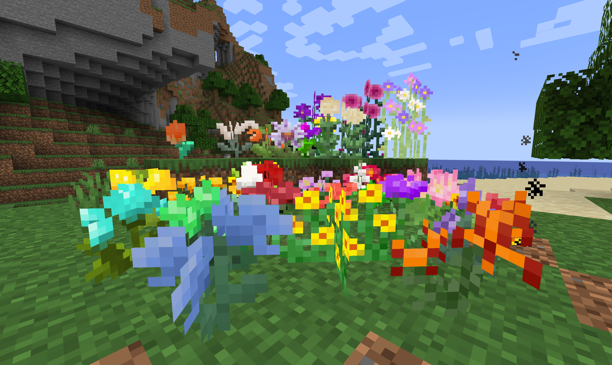
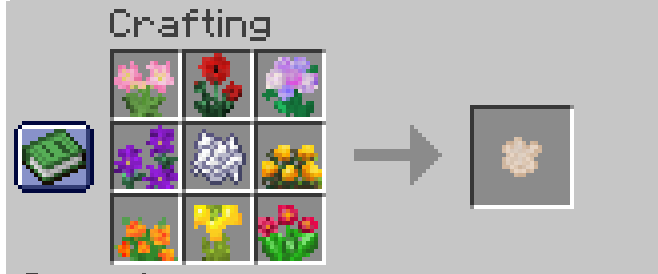
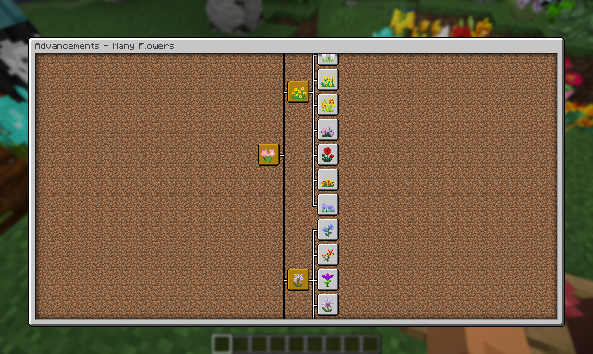
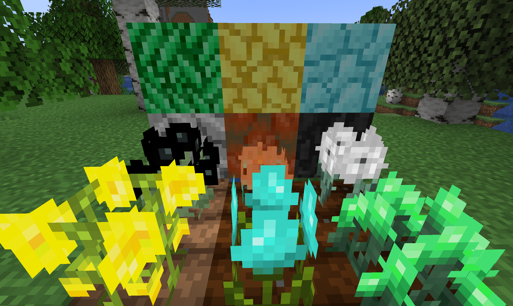
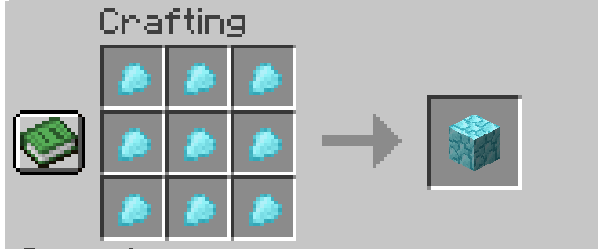
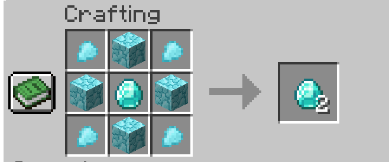

# Many Flowers

## About

In minecraft there are not enough flowers that would decorate this world. And I did this by creating my own mod, the world is now not so empty and **not so boring.**

**Flowers are divided into several types:**

- Common Flowers, *usually vanilla flowers*
- Uncommon Flowers, *gives some effects*
- Rare Flowers, *affects the world and the players.*
- Ore Flowers, *doubles ore items*
- Epic Flowers, *affects the behavior of mobs and the movement of players*

You can grow any flower from mod with random chance by floral meal:

### If you just wanna play with beautiful flowers - you can just turn off effects in config.

## Advancements as wiki

Explore flowers in Advancements where written everything about every flower.

It is recommended to use [Better Advancements](https://modrinth.com/mod/better-advancements)

## Doubling ores
Get petals from ore crop block

Crop blocks can be grew only by Floral Meal

|  |  |
|------------------------------------------|----------------------------------------|